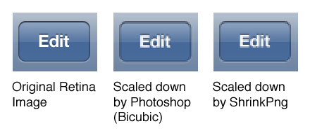

# ShrinkPng

Shrinks an image to 50% by averaging the color (and alpha) of each 2x2 pixel block.

You use this to shrink Retina images (@2x) down to the lower resolution. The assumption here is that the source image is drawn on a 2x2 grid and that all line widths and so on are multiples of 2.

The output looks similar to bicubic scaling, but slightly sharper.

## Don't use Photoshop to scale down bitmaps

Scaling down bitmaps in Photoshop is problematic because the various scaling filters (bicubic, nearest neighbor, etc) introduce artifacts. They are designed for scaling photos, not UI graphics.

I found the best way to scale down is to take each group of 2x2 pixels and average them into a single pixel. If you observe a few rules when drawing the Retina image, then this type of scaling is comparable to vector scaling

The rules are: snap everything to a 2x2 grid and make all your stroke widths multiples of two. A crisp 3-pixel stroke at high resolution turns into a blurry 2-pixel stroke when scaled down (because you can't have 1.5 pixels).

I wrote a simple command-line utility, `ShrinkPng`, that takes a @2x.png file and halves its dimensions the way I just described. It scales with higher fidelity than Photoshop, so if you've been frustrated by the way Photoshop scales down your high-res images, give this tool a shot.

You run ShrinkPng from the Terminal, like so:

    $ ShrinkPng Image@2x.png

It outputs “Image.png”, overwriting any existing file with that name. I only wrote this quickly, so there is no nice user interface. 

Note that scaling down bitmap text is a bad idea. Fonts are vector graphics that have embedded hints for drawing at small sizes, which will generally produce better results than rasterizing a font at high-resolution and scaling it down by hand, no matter which scaling algorithm you use.

## Known issues

If the image contains a color profile (as images saved from GIMP tend to) then the converted pixel values will be a little off. You can strip these headers using [pngcrush](http://pmt.sourceforge.net/pngcrush/) before running ShrinkPng:

    pngcrush -rem gAMA -rem cHRM -rem iCCP -rem sRGB in@2x.png out@2x.png
